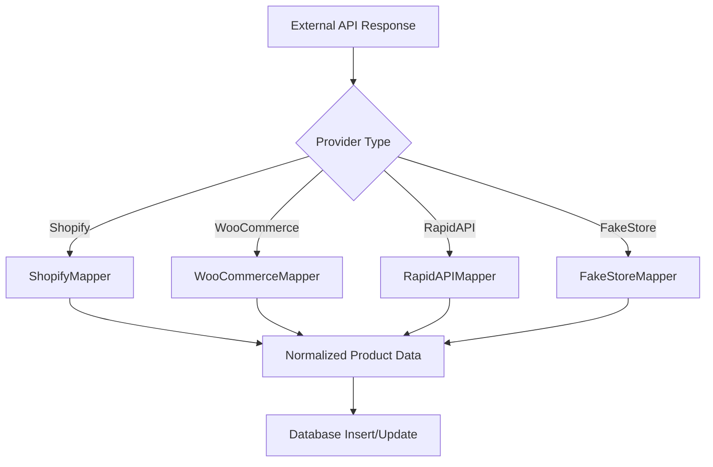
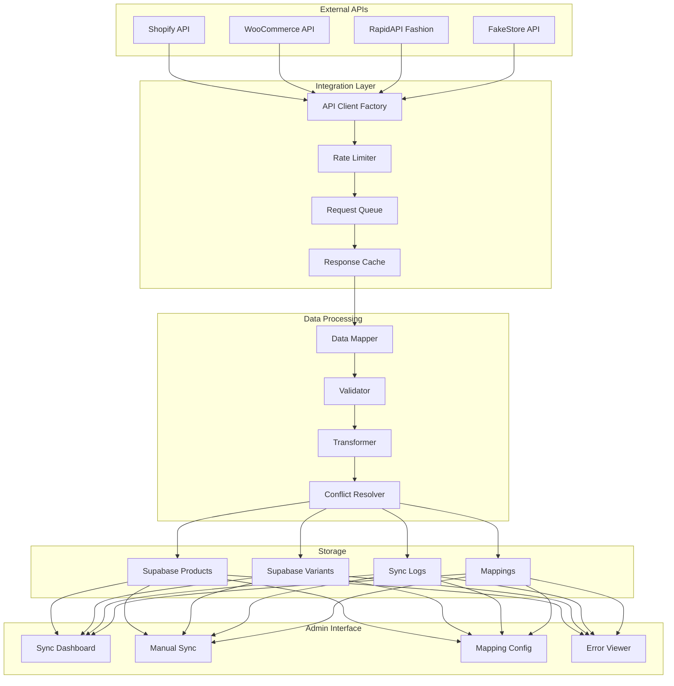
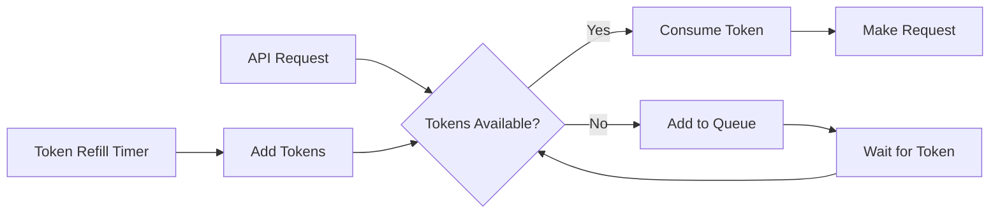
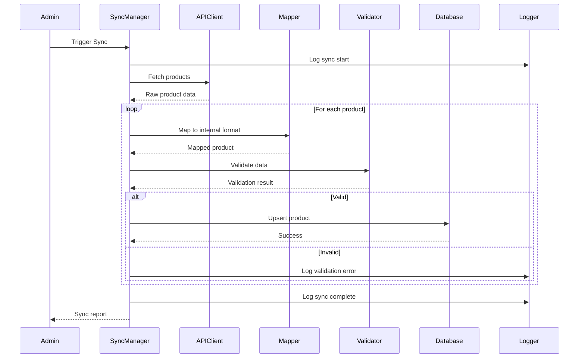

# Clothing Store API Integration Architecture Plan

## Executive Summary

This document outlines the architecture and implementation plan for integrating external clothing store APIs with the MonsterMen90 e-commerce platform. The goal is to enable real-time product data synchronization from various clothing APIs to our Supabase database.

---

## 1. Recommended Clothing APIs

### 1.1 Free/Freemium APIs

| API | Features | Rate Limits | Best For |
|-----|----------|-------------|----------|
| **FakeStoreAPI** | Basic product data, categories, images | Unlimited | Development/Testing |
| **DummyJSON** | Products with variants, ratings, stock | 100 req/min | Prototyping |
| **Platzi Fake Store** | Products, categories, users | Unlimited | Development |
| **Escuelajs API** | Products with images, categories | Unlimited | Testing |

### 1.2 Paid/Commercial APIs

| API | Features | Pricing | Best For |
|-----|----------|---------|----------|
| **RapidAPI Fashion APIs** | Real fashion data, multiple providers | Pay-per-use | Production |
| **Shopify Storefront API** | Full e-commerce data, variants, inventory | Shopify subscription | Production |
| **WooCommerce REST API** | Complete product management | Self-hosted | Production |
| **BigCommerce API** | Enterprise-grade, full catalog | BigCommerce subscription | Enterprise |
| **Printful API** | Print-on-demand products, variants | Free with orders | POD business |
| **Zalando API** | European fashion catalog | Partnership required | Fashion retail |

### 1.3 Recommended Approach

For **development and testing**: Use FakeStoreAPI or DummyJSON
For **production**: Consider RapidAPI Fashion APIs or integrate with a supplier's API

---

## 2. Database Schema Analysis

### 2.1 Current Schema Structure

```
products
├── id (UUID)
├── name (VARCHAR 255)
├── slug (VARCHAR 255, UNIQUE)
├── description (TEXT)
├── short_description (VARCHAR 500)
├── sku (VARCHAR 100, UNIQUE)
├── category_id (UUID, FK)
├── base_price (DECIMAL 10,2)
├── wholesale_price (DECIMAL 10,2)
├── cost_price (DECIMAL 10,2)
├── images (TEXT[])
├── brand (VARCHAR 100)
├── material (VARCHAR 100)
├── care_instructions (TEXT)
├── is_featured (BOOLEAN)
├── is_active (BOOLEAN)
├── meta_title (VARCHAR 255)
├── meta_description (TEXT)
├── created_at (TIMESTAMP)
└── updated_at (TIMESTAMP)

product_variants
├── id (UUID)
├── product_id (UUID, FK)
├── size (VARCHAR 10)
├── color (VARCHAR 50)
├── color_hex (VARCHAR 7)
├── sku (VARCHAR 100, UNIQUE)
├── stock_quantity (INTEGER)
├── min_stock_level (INTEGER)
├── price (DECIMAL 10,2)
├── wholesale_price (DECIMAL 10,2)
├── weight (DECIMAL 8,2)
├── dimensions (JSONB)
├── created_at (TIMESTAMP)
└── updated_at (TIMESTAMP)
```

### 2.2 New Tables Required for API Integration

```sql
-- API Integration Configuration
api_integrations
├── id (UUID)
├── name (VARCHAR 100)
├── provider (VARCHAR 50) -- shopify, woocommerce, rapidapi, etc.
├── api_url (TEXT)
├── api_key (TEXT, encrypted)
├── api_secret (TEXT, encrypted)
├── is_active (BOOLEAN)
├── sync_interval_minutes (INTEGER)
├── last_sync_at (TIMESTAMP)
├── config (JSONB) -- provider-specific configuration
├── created_at (TIMESTAMP)
└── updated_at (TIMESTAMP)

-- Sync History/Logs
api_sync_logs
├── id (UUID)
├── integration_id (UUID, FK)
├── sync_type (VARCHAR 20) -- full, incremental, manual
├── status (VARCHAR 20) -- pending, running, completed, failed
├── started_at (TIMESTAMP)
├── completed_at (TIMESTAMP)
├── products_created (INTEGER)
├── products_updated (INTEGER)
├── products_failed (INTEGER)
├── error_message (TEXT)
├── details (JSONB)
└── created_at (TIMESTAMP)

-- External Product Mapping
external_product_mappings
├── id (UUID)
├── integration_id (UUID, FK)
├── external_id (VARCHAR 255)
├── product_id (UUID, FK)
├── external_data (JSONB) -- cached API response
├── last_synced_at (TIMESTAMP)
├── sync_status (VARCHAR 20)
├── created_at (TIMESTAMP)
└── updated_at (TIMESTAMP)
```

---

## 3. Data Mapping Strategy

### 3.1 Generic API Response to Database Mapping

```typescript
interface ExternalProductData {
  // Common fields across APIs
  id: string | number;
  title?: string;
  name?: string;
  description?: string;
  price?: number;
  compare_at_price?: number;
  images?: string[] | { src: string }[];
  category?: string | { id: number; name: string };
  variants?: ExternalVariant[];
  sku?: string;
  brand?: string;
  tags?: string[];
  inventory_quantity?: number;
}

interface ProductMapping {
  // Map external field to internal field
  name: external.title || external.name;
  slug: generateSlug(external.title || external.name);
  description: external.description;
  base_price: external.price;
  wholesale_price: calculateWholesalePrice(external.price);
  images: normalizeImages(external.images);
  sku: external.sku || generateSKU(external.id);
  brand: external.brand || external.vendor;
  category_id: mapCategory(external.category);
}
```

### 3.2 Provider-Specific Mappers



---

## 4. Integration Architecture

### 4.1 High-Level Architecture



### 4.2 Service Layer Structure

```
src/lib/services/
├── api-integration/
│   ├── index.ts                    # Main exports
│   ├── api-client.factory.ts       # Factory for creating API clients
│   ├── base-api-client.ts          # Abstract base class
│   ├── rate-limiter.ts             # Rate limiting logic
│   ├── request-queue.ts            # Request queuing
│   │
│   ├── providers/
│   │   ├── shopify.client.ts       # Shopify API client
│   │   ├── woocommerce.client.ts   # WooCommerce API client
│   │   ├── rapidapi.client.ts      # RapidAPI client
│   │   ├── fakestore.client.ts     # FakeStore API client
│   │   └── index.ts
│   │
│   ├── mappers/
│   │   ├── base-mapper.ts          # Abstract mapper
│   │   ├── shopify.mapper.ts       # Shopify data mapper
│   │   ├── woocommerce.mapper.ts   # WooCommerce data mapper
│   │   ├── rapidapi.mapper.ts      # RapidAPI data mapper
│   │   ├── fakestore.mapper.ts     # FakeStore data mapper
│   │   └── index.ts
│   │
│   ├── sync/
│   │   ├── sync-manager.ts         # Main sync orchestrator
│   │   ├── sync-scheduler.ts       # Scheduled sync jobs
│   │   ├── conflict-resolver.ts    # Handle data conflicts
│   │   └── index.ts
│   │
│   └── validators/
│       ├── product.validator.ts    # Product data validation
│       └── variant.validator.ts    # Variant data validation
```

---

## 5. Error Handling Strategy

### 5.1 Error Categories

| Category | Examples | Handling Strategy |
|----------|----------|-------------------|
| **Network Errors** | Timeout, connection refused | Retry with exponential backoff |
| **Rate Limit Errors** | 429 Too Many Requests | Queue and retry after delay |
| **Authentication Errors** | 401, 403 | Alert admin, disable integration |
| **Data Validation Errors** | Invalid price, missing required fields | Log and skip, continue sync |
| **Mapping Errors** | Unknown category, invalid format | Use defaults, log warning |
| **Database Errors** | Constraint violation, duplicate | Conflict resolution strategy |

### 5.2 Retry Strategy

```typescript
interface RetryConfig {
  maxRetries: 3;
  initialDelayMs: 1000;
  maxDelayMs: 30000;
  backoffMultiplier: 2;
  retryableErrors: [
    'ETIMEDOUT',
    'ECONNRESET',
    'RATE_LIMITED',
    'SERVICE_UNAVAILABLE'
  ];
}
```

### 5.3 Error Logging

```typescript
interface SyncError {
  timestamp: Date;
  integrationId: string;
  errorType: 'network' | 'auth' | 'validation' | 'mapping' | 'database';
  errorCode: string;
  message: string;
  externalProductId?: string;
  rawData?: object;
  stackTrace?: string;
  retryCount: number;
  resolved: boolean;
}
```

---

## 6. Rate Limiting Strategy

### 6.1 Per-Provider Limits

```typescript
const rateLimits: Record<string, RateLimitConfig> = {
  shopify: {
    requestsPerSecond: 2,
    burstLimit: 40,
    dailyLimit: 10000
  },
  woocommerce: {
    requestsPerSecond: 5,
    burstLimit: 100,
    dailyLimit: null // No daily limit
  },
  rapidapi: {
    requestsPerSecond: 10,
    burstLimit: 50,
    dailyLimit: 1000 // Depends on plan
  },
  fakestore: {
    requestsPerSecond: 10,
    burstLimit: 100,
    dailyLimit: null
  }
};
```

### 6.2 Token Bucket Implementation



---

## 7. Data Synchronization Strategy

### 7.1 Sync Types

| Type | Description | Trigger | Use Case |
|------|-------------|---------|----------|
| **Full Sync** | Fetch all products | Manual, Initial setup | First-time sync, data recovery |
| **Incremental Sync** | Fetch changed products | Scheduled, Webhook | Regular updates |
| **Manual Sync** | Sync specific products | Admin action | Testing, specific updates |
| **Real-time Sync** | Webhook-based updates | External event | Inventory changes |

### 7.2 Sync Flow



### 7.3 Conflict Resolution

| Conflict Type | Resolution Strategy |
|---------------|---------------------|
| **Price Difference** | Use external price, log change |
| **Stock Mismatch** | Use external stock, update local |
| **Name Change** | Keep local if manually edited, else update |
| **Category Mismatch** | Map to closest category, flag for review |
| **Duplicate SKU** | Append provider prefix to SKU |

---

## 8. Admin Interface Design

### 8.1 Sync Dashboard Components

```
AdminAPIIntegration/
├── APIIntegrationDashboard.tsx     # Main dashboard
├── IntegrationList.tsx             # List of configured integrations
├── IntegrationForm.tsx             # Add/Edit integration
├── SyncHistory.tsx                 # Sync logs and history
├── SyncProgress.tsx                # Real-time sync progress
├── ErrorViewer.tsx                 # View and resolve errors
├── MappingConfig.tsx               # Category/field mapping
└── TestConnection.tsx              # Test API connection
```

### 8.2 Dashboard Features

1. **Integration Management**
   - Add/Edit/Delete API integrations
   - Test connection before saving
   - Enable/Disable integrations

2. **Sync Controls**
   - Manual full sync
   - Manual incremental sync
   - Sync specific products
   - Cancel running sync

3. **Monitoring**
   - Real-time sync progress
   - Success/failure statistics
   - Error logs with details
   - Sync history

4. **Configuration**
   - Category mapping
   - Field mapping overrides
   - Price adjustment rules
   - Stock threshold settings

---

## 9. Implementation Plan

### Phase 1: Foundation
- [ ] Create database migration for new tables
- [ ] Implement base API client class
- [ ] Implement rate limiter
- [ ] Create FakeStore API client for testing

### Phase 2: Core Integration
- [ ] Implement data mappers
- [ ] Create product validator
- [ ] Build sync manager
- [ ] Implement conflict resolver

### Phase 3: Admin Interface
- [ ] Create integration dashboard
- [ ] Build sync controls UI
- [ ] Implement error viewer
- [ ] Add mapping configuration

### Phase 4: Production Providers
- [ ] Implement Shopify client
- [ ] Implement WooCommerce client
- [ ] Add RapidAPI support
- [ ] Create webhook handlers

### Phase 5: Advanced Features
- [ ] Scheduled sync jobs
- [ ] Real-time webhooks
- [ ] Bulk operations
- [ ] Analytics and reporting

---

## 10. Code Structure Examples

### 10.1 Base API Client

```typescript
// src/lib/services/api-integration/base-api-client.ts
export abstract class BaseAPIClient {
  protected config: APIIntegrationConfig;
  protected rateLimiter: RateLimiter;
  
  abstract fetchProducts(options?: FetchOptions): Promise<ExternalProduct[]>;
  abstract fetchProduct(id: string): Promise<ExternalProduct>;
  abstract testConnection(): Promise<boolean>;
  
  protected async makeRequest<T>(
    endpoint: string,
    options?: RequestOptions
  ): Promise<T> {
    await this.rateLimiter.acquire();
    // Implementation with retry logic
  }
}
```

### 10.2 Sync Manager

```typescript
// src/lib/services/api-integration/sync/sync-manager.ts
export class SyncManager {
  async runSync(
    integrationId: string,
    type: 'full' | 'incremental'
  ): Promise<SyncResult> {
    const integration = await this.getIntegration(integrationId);
    const client = APIClientFactory.create(integration);
    const mapper = MapperFactory.create(integration.provider);
    
    const syncLog = await this.createSyncLog(integrationId, type);
    
    try {
      const products = await client.fetchProducts();
      const results = await this.processProducts(products, mapper);
      await this.completeSyncLog(syncLog, results);
      return results;
    } catch (error) {
      await this.failSyncLog(syncLog, error);
      throw error;
    }
  }
}
```

### 10.3 Product Mapper

```typescript
// src/lib/services/api-integration/mappers/fakestore.mapper.ts
export class FakeStoreMapper extends BaseMapper {
  mapProduct(external: FakeStoreProduct): CreateProductData {
    return {
      name: external.title,
      slug: this.generateSlug(external.title),
      description: external.description,
      base_price: external.price,
      images: [external.image],
      category_id: this.mapCategory(external.category),
      sku: `FS-${external.id}`,
      is_active: true
    };
  }
  
  mapVariants(external: FakeStoreProduct): CreateVariantData[] {
    // FakeStore doesn't have variants, create default
    return [{
      size: 'ONE_SIZE',
      color: null,
      sku: `FS-${external.id}-OS`,
      stock_quantity: 100,
      price: external.price
    }];
  }
}
```

---

## 11. Security Considerations

1. **API Key Storage**: Encrypt API keys in database
2. **Request Signing**: Use HMAC for webhook verification
3. **Rate Limiting**: Prevent abuse of sync endpoints
4. **Audit Logging**: Log all sync operations
5. **Access Control**: Admin-only access to integration settings

---

## 12. Testing Strategy

1. **Unit Tests**: Test mappers, validators, rate limiter
2. **Integration Tests**: Test API clients with mock servers
3. **E2E Tests**: Test full sync flow with FakeStore API
4. **Load Tests**: Test rate limiting under load

---

## Next Steps

1. Review and approve this plan
2. Switch to Code mode to implement Phase 1
3. Create database migration
4. Implement base classes
5. Build FakeStore integration for testing

